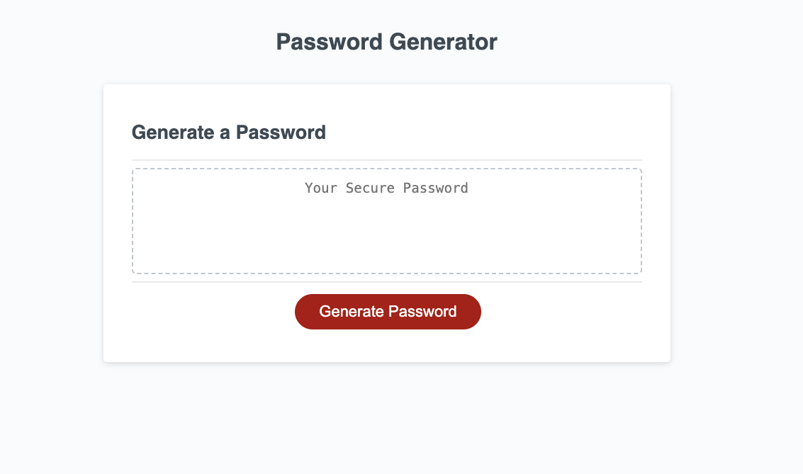

# Joe Preimesberger's Portfolio

## Description

The purpose of this project is to create a custom password generator that will generate a unique password based on user input. The user can choose the password length and type of characters included in the password, allowing for maximum password security given the criteria.

## Installation

N/A

## Usage

The website will appear as it does in the following screenshot:

## Credits

This random number function was given to the class by the instructor:

<pre>function random(min, max) {
  const num = Math.floor(Math.random() * (max - min + 1)) + min;
  return num;
}</pre>

## License

Copyright (c) 2023 Joe Preimesberger

Licensed under the MIT license.